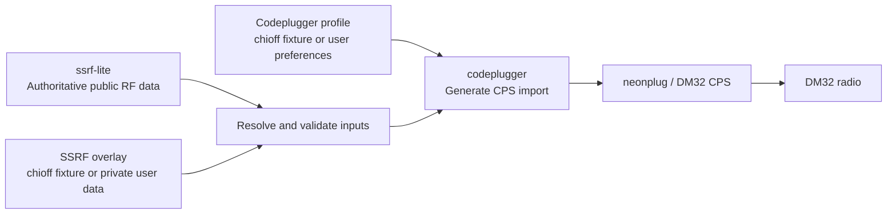

# codeplugger

`codeplugger` builds radio codeplugs from shared RF data and user-owned
configuration. Its initial target is a neonplug-compatible import for the
Baofeng DM-32, with room to support other radios and CPS tools later.

## Proposed workflow



The diagram source is also available in [docs/workflow.mmd](docs/workflow.mmd).

## Repository responsibilities

- **`ssrf-lite`** is the authoritative source for shareable RF facts: channel
  plans, repeaters, stations, talkgroups, and their schema.
- **[`chioff-ssrf-private`](https://github.com/Chicago-Offline/chioff-ssrf-private)**
  is a public reference overlay. It models the structure and merge behavior of
  a private SSRF repository using only public or synthetic fixture data.
- **`username-ssrf-private`** contains private RF records and explicit
  overrides of `ssrf-lite`, such as local names, unpublished channels, or
  user-specific grouping metadata.
- **[`chioff-codeplugger-profiles`](https://github.com/Chicago-Offline/chioff-codeplugger-profiles)**
  contains public reference profiles for Chicago Offline radios and provides
  realistic inputs for end-to-end integration tests.
- **`username-codeplugger-profiles`** contains radio and output preferences:
  channel selection, zones, scan lists, button assignments, display settings,
  and per-radio variants.
- **`codeplugger`** resolves those inputs, validates them against radio limits,
  and generates files importable by a supported CPS tool.
- **`dm32-info`** remains a research and reference repository. Stable findings
  needed for generation should become radio definitions or validation rules in
  `codeplugger`, rather than making generation depend directly on research
  notes.

## Precedence

Inputs should be merged deterministically:

1. Load RF records from `ssrf-lite`.
2. Add or override RF records from `username-ssrf-private` using stable record
   identifiers, not display names.
3. Apply a selected codeplug profile to choose and arrange records and set
   radio-specific preferences.
4. Validate the result against the target radio and exporter constraints.
5. Generate the CPS import as a disposable build artifact.

Generated codeplugs should not become an authoritative data source. Changes
should flow back into SSRF data or the selected profile and then be regenerated.

## Reference and user repositories

RF data describes what exists; a profile describes what a person wants
programmed into a particular radio. Keeping those concerns separate makes
profiles reusable across SSRF dataset updates and avoids mixing device
settings into an RF schema.

The two `chioff-*` repositories form a public reference configuration for
integration testing:

```text
ssrf-lite + chioff-ssrf-private + chioff-codeplugger-profiles -> codeplugger
```

Despite its name, `chioff-ssrf-private` is public: "private" describes its role
as an overlay in the merge model. Real user repositories may follow the same
layout while remaining private. Public fixtures must not contain personal
identities, unpublished frequencies, credentials, location-sensitive records,
or exports from real radios.

Small synthetic fixtures should remain in this repository for fast,
deterministic unit tests. The `chioff-*` repositories are intended for broader
cross-repository contract and end-to-end tests.

## Initial scope

The first end-to-end milestone is intentionally narrow:

1. Read `ssrf-lite` plus optional private overrides.
2. Read one DM-32 profile.
3. Validate channel and radio constraints.
4. Produce an import accepted by neonplug.

The directories in this repository are intended to evolve along these lines:

- `radios/`: radio capabilities, constraints, and exporter-specific mappings.
- `profiles/`: public examples and fixtures, not real user secrets.

## Profile format

Profile version `0.1` selects ordered SSRF assignments by stable ID and groups
them into ordered zones for one target radio:

```yaml
$schema: "https://raw.githubusercontent.com/Chicago-Offline/codeplugger/main/schemas/profile-0.1.schema.json"
version: "0.1"
id: "dm32_reference"
name: "DM-32 reference"
radio: "baofeng_dm32"
zones:
  - id: "reference"
    name: "Reference"
    assignments:
      - "asg_fixture_reference_simplex"
      - "asg_wx1"
```

Profiles contain selection and ordering policy, not RF facts or per-user radio
identities. Display-name or RF changes belong in an SSRF overlay. Version `0.1`
intentionally excludes selectors, scan lists, contacts, button mappings, and
exporter settings until the explicit-ID workflow is proven end to end.

Validate a profile against authoritative data, overlays, and radio limits:

```bash
uv run codeplugger-profile path/to/profile.yml \
  --ssrf-root ../ssrf-lite/ssrf \
  --ssrf-root ../chioff-ssrf-private/ssrf
```
