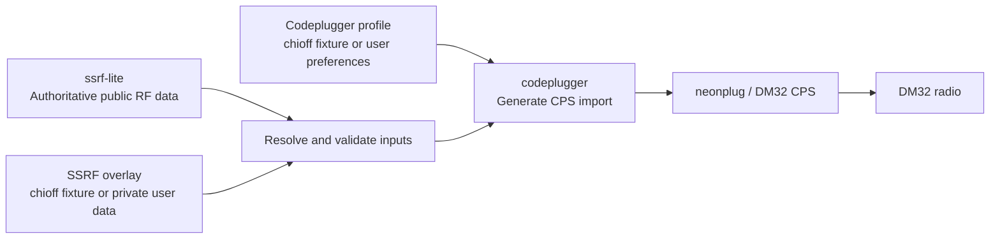

# codeplugger

`codeplugger` builds radio codeplugs from shared RF data and user-owned
configuration. Its initial target is a neonplug-compatible import for the
Baofeng DM-32, with room to support other radios and CPS tools later.

## Proposed workflow



The diagram source is also available in [docs/workflow.mmd](docs/workflow.mmd).

## Repository responsibilities

- **`ssrf-lite`** is the authoritative source for shareable RF facts: channel
  plans, repeaters, stations, talkgroups, and their schema.
- **[`chioff-ssrf-test`](https://github.com/Chicago-Offline/chioff-ssrf-test)**
  is a public reference overlay. It models the structure and merge behavior of
  a private SSRF repository using only public or synthetic fixture data.
- **[`chioff-ssrf-shared`](https://github.com/Chicago-Offline/chioff-ssrf-shared)**
  holds real Chicago Offline community-net RF facts (shared GMRS and MURS
  channels) that members merge on top of `ssrf-lite`.
- **`username-ssrf-private`** contains private RF records and explicit
  overrides of `ssrf-lite`, such as local names, unpublished channels, or
  user-specific grouping metadata.
- **[`chioff-codeplugger-profiles-test`](https://github.com/Chicago-Offline/chioff-codeplugger-profiles-test)**
  contains public reference profiles for Chicago Offline radios and provides
  realistic inputs for end-to-end integration tests.
- **[`chioff-codeplugger-profiles-shared`](https://github.com/Chicago-Offline/chioff-codeplugger-profiles-shared)**
  contains profiles selecting the shared community net for supported radios.
- **`username-codeplugger-profiles`** contains radio and output preferences:
  channel selection, zones, scan lists, button assignments, display settings,
  and per-radio variants.
- **`codeplugger`** resolves those inputs, validates them against radio limits,
  and generates files importable by a supported CPS tool.
- **`dm32-info`** remains a research and reference repository. Stable findings
  needed for generation should become radio definitions or validation rules in
  `codeplugger`, rather than making generation depend directly on research
  notes.

## Precedence

Inputs should be merged deterministically:

1. Load RF records from `ssrf-lite`.
2. Add or override RF records from `username-ssrf-private` using stable record
   identifiers, not display names.
3. Apply a selected codeplug profile to choose and arrange records and set
   radio-specific preferences.
4. Validate the result against the target radio and exporter constraints.
5. Generate the CPS import as a disposable build artifact.

Generated codeplugs should not become an authoritative data source. Changes
should flow back into SSRF data or the selected profile and then be regenerated.

## Reference and user repositories

RF data describes what exists; a profile describes what a person wants
programmed into a particular radio. Keeping those concerns separate makes
profiles reusable across SSRF dataset updates and avoids mixing device
settings into an RF schema.

The two `chioff-*` repositories form a public reference configuration for
integration testing:

```text
ssrf-lite + chioff-ssrf-test + chioff-codeplugger-profiles-test -> codeplugger
```

The `-test` repositories hold only synthetic fixture data and exist to model
the overlay merge behavior. Real user repositories may follow the same layout
while remaining private. Public fixtures must not contain personal identities,
unpublished frequencies, credentials, location-sensitive records, or exports
from real radios.

The `-shared` repositories are the exception: they carry real Chicago Offline
community-net channels that are intended to be published and shared. They
still must not contain personal identities, credentials, or radio exports.

Small synthetic fixtures should remain in this repository for fast,
deterministic unit tests. The `chioff-*` repositories are intended for broader
cross-repository contract and end-to-end tests.

## Initial scope

The first end-to-end milestone is intentionally narrow:

1. Read `ssrf-lite` plus optional private overrides.
2. Read one DM-32 profile.
3. Validate channel and radio constraints.
4. Produce an import accepted by neonplug.

The directories in this repository are intended to evolve along these lines:

- `radios/`: radio capabilities, constraints, and exporter-specific mappings.
- `profiles/`: public examples and fixtures, not real user secrets.

## Profile format

Profile version `0.1` selects ordered SSRF assignments by stable ID and groups
them into ordered zones for one target radio:

```yaml
$schema: "https://raw.githubusercontent.com/Chicago-Offline/codeplugger/main/schemas/profile-0.1.schema.json"
version: "0.1"
id: "dm32_reference"
name: "DM-32 reference"
radio: "baofeng_dm32"
radio_instance: "dm32_reference_01"
zones:
  - id: "reference"
    name: "Reference"
    assignments:
      - "asg_fixture_reference_simplex"
      - "asg_wx1"
```

`radio` identifies the radio model and `radio_instance` identifies the specific
physical radio receiving the generated codeplug. The instance ID is arbitrary
but stable, such as `dm32_green_01` or `d01`. Profiles that omit it retain
backward compatibility by using their profile `id` as the instance ID.

Profiles contain selection and ordering policy, not RF facts or per-user DMR
identities. Display-name or RF changes belong in an SSRF overlay. Version `0.1`
intentionally excludes selectors, scan lists, contacts, button mappings, and
exporter settings until the explicit-ID workflow is proven end to end.

Validate a profile against authoritative data, overlays, and radio limits:

```bash
uv run codeplugger-profile path/to/profile.yml \
  --ssrf-root ../ssrf-lite/ssrf \
  --ssrf-root ../chioff-ssrf-test/ssrf
```

Inspect the normalized, exporter-neutral codeplug as deterministic YAML or
JSON:

```bash
uv run codeplugger-profile path/to/profile.yml \
  --ssrf-root ../ssrf-lite/ssrf \
  --ssrf-root ../chioff-ssrf-test/ssrf \
  --output-format yaml
```

The normalized model contains ordered channels and zones, radio-facing RX/TX
frequencies, mode, service, analog tones, overlay-resolved notes, and explicit
TX permission. It intentionally excludes scan lists, contacts, DMR identities,
button settings, and NeonPlug fields; exporters translate this stable model
without participating in input resolution.

## P4 TOML export

The P4 exporter requires a TOML file produced by `p64tool decode` as its
baseline. It updates resolved channel and zone records in place and preserves
radio-wide settings, existing contacts, RX groups, and fields codeplugger does
not yet model. It can also explicitly set analog bandwidth, clear unused
channel/zone slots, and add contacts from a fleet registry:

```python
from codeplugger.exporters.p64_toml import p64_toml_from_resolved

output = p64_toml_from_resolved(
  resolved,
  baseline_toml,
  fleet_instances=registry["instances"],
  clear_unused_channels=True,
  analog_bandwidth_khz=25.0,
  digital_contact_index=1,
  digital_rx_group_index=1,
)
```

When `fleet_instances` is supplied, the target radio's `dmr_id` becomes
`general.radio_dmr_id` and each registry radio is appended as a private
contact. Contact and RX-group indices must refer to records already present in
the baseline; the exporter does not invent talkgroup semantics.

The external `p64tool` backend wrapper provides read-only `info`, `read`, and
`roundtrip` operations plus an explicit `confirm=True` write operation. It
always uses p64tool's known-firmware gate and read-back verification by default.

## Radio artifacts and operation logs

Resolved profiles can produce a self-contained, printable HTML reference and a
JSON Lines operation log under the profiles repository. The artifact format is
radio-independent, so it works for DM-32, P4, and other resolved radio models:

```bash
uv run codeplugger-profile path/to/profile.yml \
  --ssrf-root ../ssrf-lite/ssrf \
  --ssrf-root ../chioff-ssrf-test/ssrf \
  --output-format html \
  --artifact-root path/to/profiles
```

This creates `.artifacts/<radio>/<radio-instance>/reference.html` and
`operations.jsonl`. The latter records successful profile generation and can
also be passed to a backend as an `ArtifactStore` to audit device reads and
writes. Generated artifacts are evidence of an operation, not an authoritative
profile or RF data source.

## Registry-driven fleet dry run

The physical fleet registry is the source of truth for which radio instance
gets which profile. A registry entry's `profile` value names a profile file
under the profile repository, and the profile's `radio_instance` must match the
registry key. No radio is changed by this command:

```bash
uv run codeplugger-fleet \
  --instance-registry ../muehlstein-codeplugger-profiles/instances.yml \
  --profiles-root ../muehlstein-codeplugger-profiles/profiles \
  --ssrf-root ../ssrf-lite/ssrf \
  --ssrf-root ../muehlstein-ssrf-private/ssrf
```

The command resolves every registered radio, validates its profile against the
radio capabilities, and reports a deterministic SHA-256 of the resolved
codeplug. A nonzero exit status means at least one instance is not ready; this
is the planning gate before a programming adapter is invoked.

## CHIRP workflow for analog radios

For analog radios such as the UV-5R Mini, codeplugger can emit CHIRP-compatible
CSV and CHIRP remains the upload interface to the radio.

Generate CHIRP CSV from a validated profile:

```bash
uv run codeplugger-profile path/to/profile.yml \
  --ssrf-root ../ssrf-lite/ssrf \
  --ssrf-root ../chioff-ssrf-test/ssrf \
  --output-format chirp-csv > output.csv
```

Then import `output.csv` in CHIRP and upload from CHIRP to the radio.

Notes:

- CHIRP CSV export currently supports FM channels only.
- Any non-FM channel selected by the profile fails export with an explicit
  error.
- Channel order in the CSV matches resolved profile order.

## Optional instance registry

Profiles may declare `radio_instance`, and codeplugger can optionally validate
that identifier against a separate instance registry document:

```yaml
version: "0.1"
instances:
  dm32_green_01:
    radio: baofeng_dm32
    label: "Green DM-32"
    firmware: "DM32.01.L01.048"
```

Use `--instance-registry` to enable this join check:

```bash
uv run codeplugger-profile path/to/profile.yml \
  --ssrf-root ../ssrf-lite/ssrf \
  --instance-registry path/to/instances.yml
```

When enabled, codeplugger verifies:

- the profile instance ID exists in the registry
- the registry entry's `radio` matches the profile's `radio`

If no registry is provided, behavior stays backward compatible with existing
profile-only workflows.
